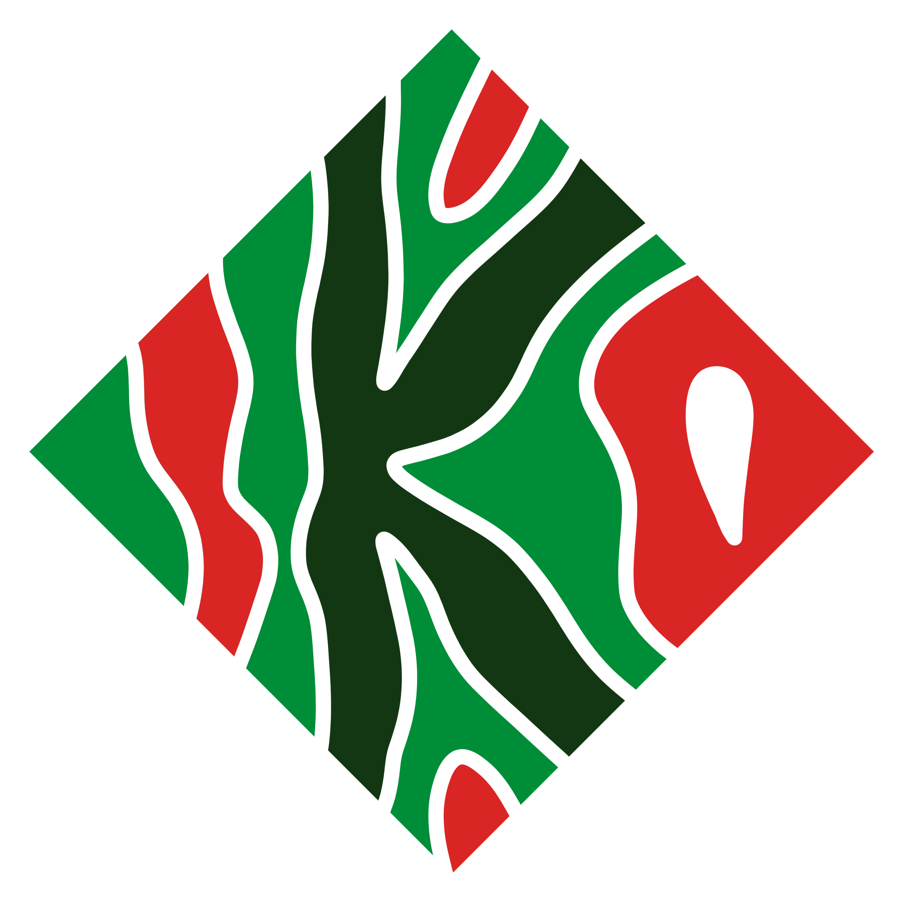

<p align="center">
  
</p>

<p align="center">Kaarna</p>

[](https://github.com/maxerenberg/cabbagemeet/actions?query=workflow%3ACI)

## Mikä tämä on?
Kaarnalla voit sopia ihmisjoukon kesken kaikille sopivan ajankohdan tapaamiselle, palaverille, mitä ikinä. Jokainen valitsee itsellensä sopivat ajat ja tämä ohjelma löytää kaiken sotkun seasta kaikille sopivan ajankohdan. Magic ✨

## Running in development mode
### Backend
```bash
cd server
npm install
# Will listen on port 3001 by default, set PORT in .development.env to
# change this
npm start

# Open a new terminal window
# The mock SMTP server is needed for signup email verification
# Set VERIFY_SIGNUP_EMAIL_ADDRESS=false in .development.env to disable it
cd server
scripts/mockSmtpServer.js
```

### Frontend
```bash
# Start the React app
cd client
npm install
# Will listen on port 3000 by default and proxy API requests to port 3001
# Set the environment variables PORT and PROXY_PORT to change this
npm start
```

## Running in production mode
```bash
# Create a static build
cd client
# set the env variable REACT_APP_API_BASE_URL if the domain of the
# API server is not the same as the website itself
npm run build

cd ../server
# Create a symlink to the static build folder (or just copy it)
ln -sf ../client/build client
npm run build
# Set any necessary environment variables
# See the server README for more details
vim .env
# Start the app
npm run start:prod
```
